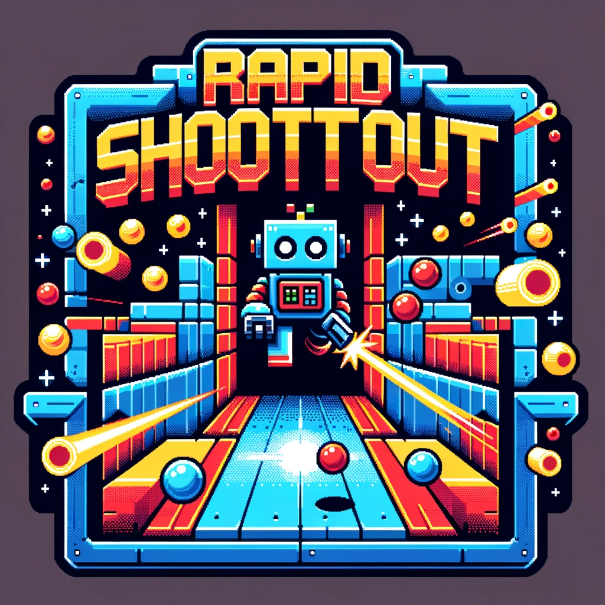

# Rapid-Shootout-MiniMatrixGame

Task Requirements

---

This game was developed as part of the homeworks for the course "Introduction to Robotics" at the University of Bucharest.
The task for this homework was to develop a game that uses an 8x8 LED matrix and an LCD display. The game should be controlled by a joystick and buttons and should provide the user with a menu and a way of progressing in the game.

 

General Presentation

---

The game is a one-player shooter, where the player is spawned randomly in a room and has to shoot walls in order to be able to enter other ones. Walls are generated automatically and each one gives points based on the difficulty chosen by the player. The game ends when the player runs out of lives, destroys all the walls or runs out of time. Bullets come back after not hitting a wall and going out of the room, endangering the lives of the user. The player also has the chance to get streaks of destroyed walls, that double the points. During the last five seconds of the round, the current room gets shut and the points double, giving the chance to the player to shoot uninterruptedly, not fearing losing lives. This also means that entering a full room before the end, but not too soon, gives them an edge.

 

How to Play

---

 
  

    

    Menu Navigation
    

    <ul>
      <li>Scrolling through the menu is done with the joystick, by moving it up and down.</li>
      <li>Selecting an option is done by pressing the button or by moving the joystick to the right.</li>
      <li>Going back to the previous menu is done by moving the joystick to the left.</li>
      <li>!The play option may not be selected via the joystick, in order to not start the game by mistake.</li>
    </ul>
    

  

    

    Game Controls
    

    <ul>
      <li>Moving the player is done by moving the joystick in the desired direction.</li>
      <li>Shooting is done by pressing the button, and the bullet will take the last direction of the player.</li>
    </ul>
    

  

    

    Game Rules and Player Bonuses
    

    <ul>
      <li>Each wall values 1p, 2p or 3p, based on the difficulty of the round: Easy, Medium, Hard</li>
      <li>Each round lasts for 90s, 60s or 30s, based on the difficulty of the round: Easy, Medium, Hard</li>
      <li>The player has 5, 4 or 3 lives, based on the difficulty of the round: Easy, Medium, Hard</li>
      <li>The player navigates the rooms by going out of the matrix bounds</li>
      <li>Bullets travel the current matrix by returning in bounds, on the other side, after exiting it</li>
      <li>A streak can be obtained by shooting walls in order, with less than 900ms between them. This will double their values.</li>
      <li>During the last 5 seconds of each round, the room gets locked and the player cannot leave the room. The points are doubled during this moment.</li>
    </ul>
    

 

Physical Requirements

---

  <ul>
  <li>Arduino Board</li>
  <li>Breadboard</li>
  <li>8x8 LED Matrix</li>
  <li>Joystick</li>
  <li>Button</li>
  <li>Buzzer</li>
  <li>2x 10 kOhm Resistor for pull-down</li>
  <li>20 kOhm Resistor for LED Matrix</li>
  <li>100 uF Electroytic Capacitor</li>
  <li>0.1 uF Ceramic Capacitor</li>
  <li>Wires</li>
  </ul>

